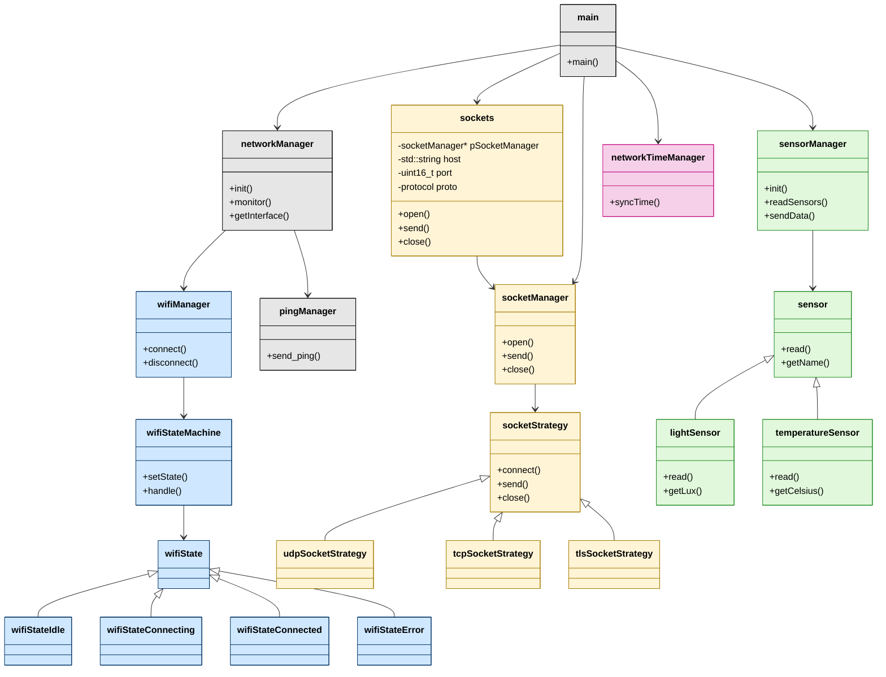

# Zephyr Example Application

<a href="https://wakatime.com/badge/github/osamasalahuddin/zephyr_home">
    
</a>
<a href="https://github.com/zephyrproject-rtos/example-application/actions/workflows/build.yml?query=branch%3Amain">
  
</a>
<a href="https://github.com/zephyrproject-rtos/example-application/actions/workflows/docs.yml?query=branch%3Amain">
  
</a>
<a href="https://zephyrproject-rtos.github.io/example-application">
  
</a>
<a href="https://zephyrproject-rtos.github.io/example-application/doxygen">
  
</a>

# 🌐 Zephyr Home – ESP32 Smart Sensor Platform

**Zephyr Home** is a modular, event-driven IoT system built on top of **Zephyr RTOS** for the **ESP32 DevKitC WROOM** board. It combines Wi-Fi management, time synchronization, sensor polling, and data transmission through sockets using clean object-oriented design and state machines.

---

## 🧠 What This App Does

- ✅ Connects to Wi-Fi using a State Machine
- 🕓 Syncs time from an NTP server via SNTP
- 🌡️ Reads data from I²C-based sensors (light, temperature)
- 📤 Sends sensor data over UDP/TCP/TLS using a pluggable socket strategy
- 🔁 Reconnects and retries intelligently on failure
- 📊 Logs diagnostics over console and optionally via UDP

---

## 📦 Key Components (Inside `app/src`)

| Folder               | Description                                                       |
|----------------------|-------------------------------------------------------------------|
| `wifiManager`        | Controls Wi-Fi connection lifecycle                               |
| `wifiSM`             | Implements a full Wi-Fi **state machine** (Idle → Connected → …) |
| `networkManager`     | Central hub for connectivity, ping, time sync, and socket handling|
| `socketManager`      | Opens, sends, and closes sockets by protocol + host + port        |
| `sockets`            | Simple wrapper class for socket usage in modules                  |
| `sensorManager`      | Manages all attached sensors and handles polling + sending        |
| `lightSensor`        | Reads light levels from **TSL2561** over I²C                      |
| `temperatureSensor`  | Stub for any temperature sensor (e.g., TMP117 or similar)         |
| `networkTimeManager` | SNTP-based network time syncing                                   |
| `pingManager`        | Sends ICMP pings and listens for replies                          |
| `main.cpp`           | Bootstraps the system and schedules runtime behavior              |

---


## 📘 UML Class Diagram

### ✅ Color Legend

| Color        | Category       |
|--------------|----------------|
| 🟦 Blue       | WiFi subsystem |
| 🟨 Yellow     | Socket system  |
| 🟩 Green      | Sensor system  |
| 🩷 Pink       | Time sync      |
| ⚪ Gray       | Core entry & infra |





## 🛠 Board Support

- 🧩 Board: `esp32_devkitc_wroom/esp32`
- 🔌 Peripherals:
  - I²C on GPIO21 (SDA) and GPIO22 (SCL)
  - Wi-Fi via onboard ESP32 radio

---

## 🧪 Example Behavior

1. On boot, the system enters `Idle`
2. Wi-Fi state machine transitions: `Idle → Connecting → Connected`
3. Once online:
    - Time is synced via SNTP
    - Sensors are polled periodically
    - Data is sent over the selected socket protocol
4. If disconnected, it auto-retries or gracefully resets

---

## 🛠 Build + Flash Instructions (Zephyr SDK)

Make sure you've set up Zephyr correctly with ESP32 support.

```bash

# From workspace root
west init -l app/
west update
west zephyr-export

# Build for ESP32 DevKitC WROOM
west build -b esp32_devkitc_wroom/esp32/procpu app

# Flash to board
west flash

# Monitor Console
west espressif monitor

```

## 💡 Using Tasks in VSCode

If opened up the from the workspace file the common Tasks are already setup you can use **VSCode Tasks** defined in `zephyr_home.code-workspace`.

### Common Tasks

- 🛠 `Build and Flash`: Shortcut: **Ctrl+Shift+B** runs: `west build && west flash`
- 🖥 `Flash Firmware`: Shortcut: **F5** runs: `west espressif monitor`

### Usage

1. Press **Ctrl+Shift+P** → `Tasks: Run Task`
2. Choose from:
   - `Build Only`
   - `Build Flash`
   - `Build Flash Monitor`
   - `Flash Monitor`
   - `Monitor Only`

---

## 📝 License

This project is licensed under the **GNU AGPLv3**
© 2025 **Osama Salah-ud-Din**

---

### Testing

To execute Twister integration tests, run the following command:

```shell
west twister -T tests --integration
```

### Documentation

A minimal documentation setup is provided for Doxygen and Sphinx. To build the
documentation first change to the ``doc`` folder:

```shell
cd doc
```

Before continuing, check if you have Doxygen installed. It is recommended to
use the same Doxygen version used in [CI](.github/workflows/docs.yml). To
install Sphinx, make sure you have a Python installation in place and run:

```shell
pip install -r requirements.txt
```

API documentation (Doxygen) can be built using the following command:

```shell
doxygen
```

The output will be stored in the ``_build_doxygen`` folder. Similarly, the
Sphinx documentation (HTML) can be built using the following command:

```shell
make html
```

The output will be stored in the ``_build_sphinx`` folder. You may check for
other output formats other than HTML by running ``make help``.

