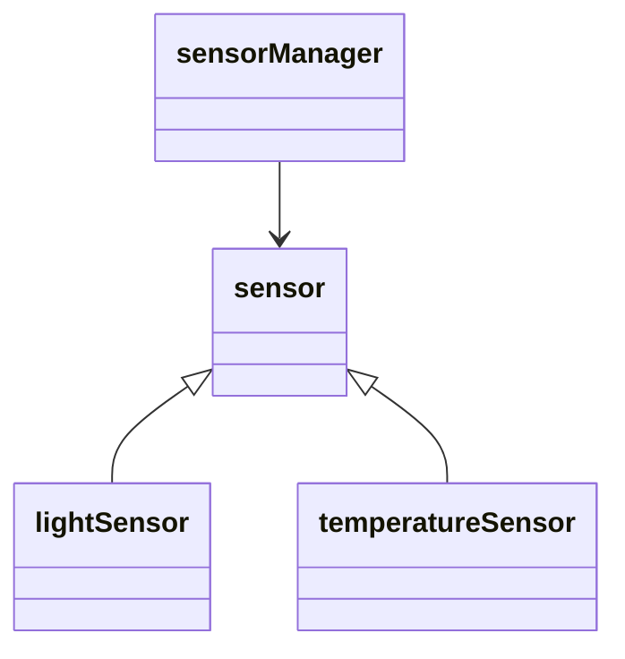

# 🌡️ Sensor Manager

Handles polling and sending sensor data.

## 🧩 Design Pattern: Template/Strategy

Sensors inherit from a base `sensor` interface and implement `read()` + `getName()`.

## 📚 Flow

## 🔄 Workflow

- sensorManager owns a list of sensors
- Calls readSensors()
- Uses sockets to send their data