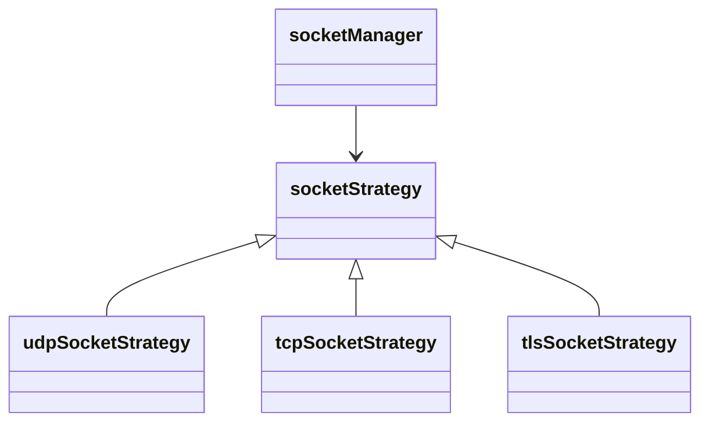

# 🧩 Socket Manager

Handles opening and managing multiple sockets using the **Strategy Pattern**.

## 🧩 Design Pattern: Strategy

Each protocol (UDP, TCP, TLS) is implemented as a strategy class that conforms to `socketStrategy`.

## 📚 Structure

- `socketStrategy.hpp`: Interface
- `udpSocketStrategy`, `tcpSocketStrategy`, `tlsSocketStrategy`: Concrete strategies
- `socketManager.hpp/cpp`: Manages a map of sockets
- `sockets.hpp`: Simplified wrapper for clients

## 🧠 Flow

## 🔁 Usage

- Call socketManager::open(protocol, host, port)
- It stores the corresponding strategy