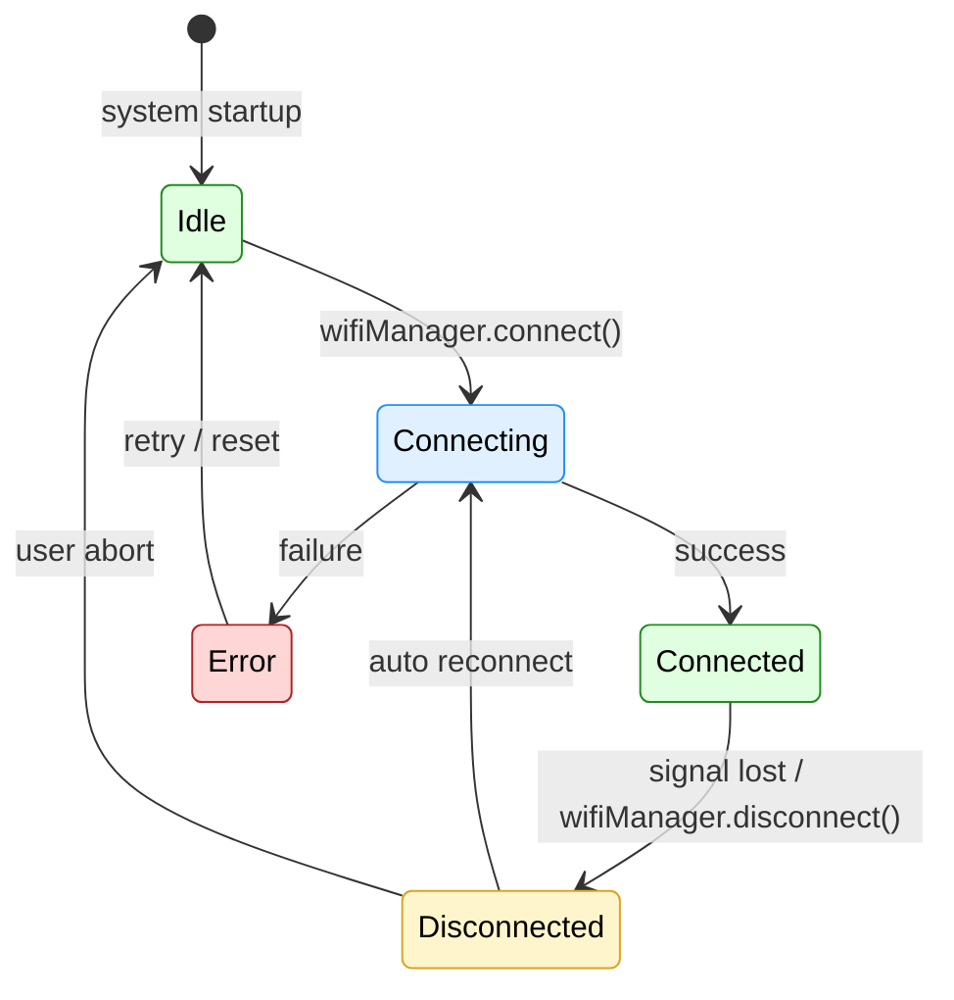

# 📡 WiFi Manager

This module manages the overall WiFi connection process and delegates connection logic to the `wifiStateMachine`.

## 💡 Responsibilities

- Starts the connection via `connect()`
- Uses `wifiStateMachine.setState()` to drive transitions
- Registers callbacks for connection events

## 🔄 Flow Overview

1. `connect()` triggers transition to Connecting
2. Callback triggers success/failure
3. WiFiManager observes and reacts

## 📶 WiFi Manager – State Transition Diagram

